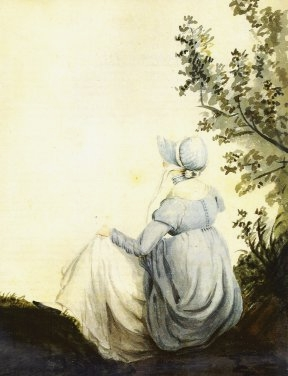

<param ve-config style="article">

## Jane Austen (
**16 December 1775 - 18 July 1817)
.**  
**Places:** Ashford, Canterbury, Chilham, Dartford, Eastwell, Godmersham, Goodnestone & Rowling, Ramsgate, Sevenoaks, Tonbridge, Tunbridge Wells 

{: .right .dropshadow}

> 

  
  
<b>Cassandra Austen (1773-1845) / Public domain</b>

‘Are you pleased with Kent?’  _
Pride and Prejudice_

One of the greatest English novelists of all time, Jane Austen visited Kent regularly to see her brother, Edward Austen Knight, who lived first at Rowling House, near Goodnestone, where Austen stayed in 1794 and 1796, and later at the magnificent Godmersham Park, where Austen visited six times between 1798 and 1813.  During or shortly after her visit to Rowling in 1796, Austen began writing ‘First Impressions’, the story which was later published as _Pride and Prejudice_ in 1813.  The novel may reflect, in the figure of Lady Catherine De Bourgh, for example, some of the class snobbery Austen witnessed in mixing with what she termed “East Kent wealth”. 

During her extended stays with her brother, Austen enjoyed frequent trips to [Canterbury](19c-canterbury) as well as occasional outings to Ashford, Eastwell Manor, and [Ramsgate](/dickens/19c-ramsgate).  She often travelled into Kent via Dartford, where she and her family dined and lodged at the now-demolished Bull and George.  Her first experience of Kent, however, took place in 1788 on a visit to her great uncle Francis Austen in Sevenoaks.  At a grand meal he hosted at his stately Red House, Austen met the wealthiest branch of her family and, likely, drew inspiration for the dinner party at Grants’ rectory in _Mansfield Park_ (1814).[^ref1] (ODNB).  Visits to her brother also offered Austen access to his library, which comprised over 1200 books, among them biographical, historical, and religious writings, periodicals, dictionaries, and maps, as well as the latest novels of the day.[^ref2] (Reading with Austen). 

Kent locations feature in several of Austen’s novels, and have been used as the sets for modern film and television adaptations as well.  Since at least the turn of the century, literary tourists have been interested in Jane Austen’s Kent connections, and books, guided walks, and place-related talks are now widely on offer. 

**Article written by:** Dr Susan Civale

### Bibliography 
Butler, Marilyn.  [Austen, Jane.](https://doi.org/10.1093/ref:odnb/904) [_Oxford Dictionary of National Biography._

Le Faye, Deirdre, Ed. _Jane Austen’s Letters._ Oxford: OUP, 2014

### Footnotes

[^ref1]: Butler, Marilyn.  [Austen, Jane.](https://doi.org/10.1093/ref:odnb/904) _Oxford Dictionary of National Biography._
[^ref2]: [Reading with Austen](https://readingwithaustenblog.com/)] (https://www.oxforddnb.com/view/10.1093/ref:odnb/9780198614128.001.0001/odnb-9780198614128-e-904)
Le Faye, Deirdre, Ed. _Jane Austen’s Letters._ Oxford: OUP, 2014
<!--stackedit_data:
eyJoaXN0b3J5IjpbMjU0MTM2MzJdfQ==
-->