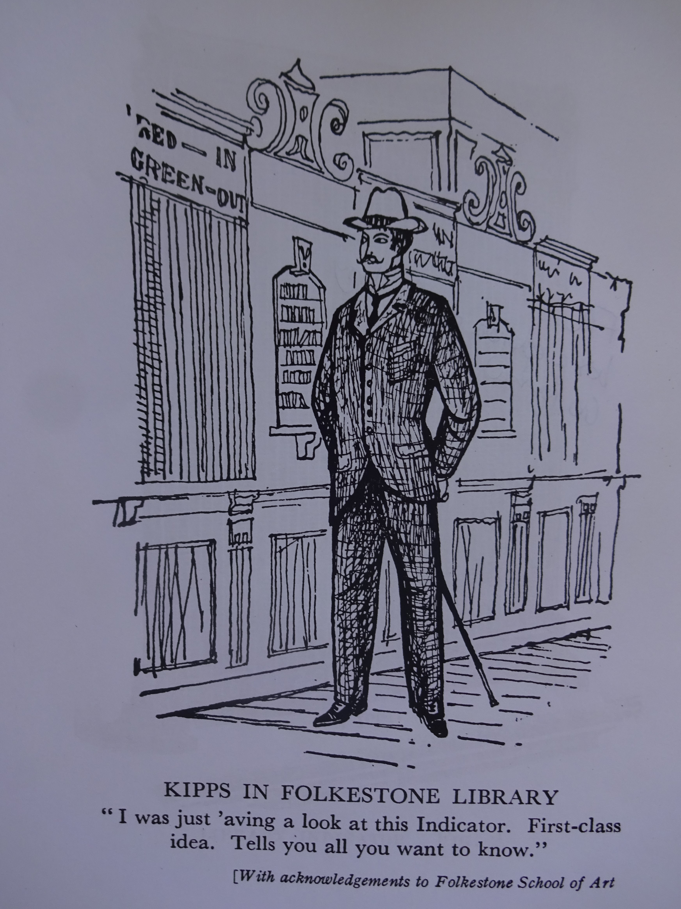

# Folkestone Free Library

**Founded 1879

{: .right .dropshadow}

Whilst the Libraries Act of 1850 enabled provision of public libraries through the rates, provincial towns were unaccountably reluctant, in short -  as Mr Micawber might have put it - they were slow to act. Canterbury Museum and Public Library (now The Beaney) opened its doors in 1858, making it the first free library in England.
Around twenty years later in 1879 the [Folkestone Free Library](https://webapps.kent.gov.uk/KCC.Libraries.Web.Sites.Public/LibraryDetails.aspx?aid=0&lid=32&uprn=50040690) was established on the Bayle,  although the initial catalogue was not published until 1881. The inclusion of blank pages to record any donations, coupled with the distinction between ‘Literature’ and ‘Novels and Fiction’ offers a clue to one of the challenges faced by librarian George Hills – many people objected to fiction being paid for out of public funds. The 1890 catalogue was arranged with the help of a deeply conservative local clergyman, the Rev. Hall, who personally eschewed all novelists later than [Dickens](https://kent-maps.online/dickens). Not surprisingly it has no separate heading for fiction at all. 

{: .right .dropshadow}

When the library was moved from the Bayle to Grace Street in April 1888, it had the advantage of being in the same building as the town’s museum, and was able to provide a reading room, reference room, committee room and separate ladies’ room. One joker in 1893 suggested that the ‘Silence’ notice must have been hidden in the Ladies’ Reading Room;  nonetheless the library was employing female staff by at least 1896.  

Determined to maintain its standards, the library had strict regulations, including ‘No person shall be admitted who is in an intoxicated or dirty condition…’  Presumably not for this reason, a separate children’s section was considered unnecessary until the twentieth century. 

Nor was the open access system adopted until 1910. Before then anyone wanting to borrow a book would have to brave a possibly disapproving librarian, having first consulted the library ‘indicator’. This simple device – dividing titles firmly into categories - showed readers whether a book was available or in use. 

[H. G. Wells](/19c-wells-biography) sends Kipps to the Folkestone library in 1905, where he claims nervously, ‘I ‘aven’t got a ticket yet. But I shall get one all right, and have a go in at reading. I’ve often wanted to. Rather. I was just ‘aving a look at this Indicator. First-class idea. Tells you all you want to know’. 

In 1902 Rev. Hall and a group of ‘lady volunteers’ helped the librarian to re-catalogue the collection, taking the opportunity to purge it of obsolete volumes. Predictably some of the more sensational titles disappeared at this point. Nonetheless a slight spike in the acquisition of non-canonical Victorian fiction may speak to a moment of nostalgia either at the fin de siècle (the last extant catalogue is from 1896) or in the wake of Victoria’s death the year before. 

Hill would doubtless have been relieved to know that in 1926 the library flatly refused one donation. Aylmer Maude’s _The Life of Dr Marie Stopes_ commemorating the famously controversial _Married Love_ author, contains no direct reference to birth control, but almost fifty years after the library first opened its doors it was still being careful about who came through them. 

### Bibliography

{: .right .dropshadow}

Catalogues of the Folkestone Free Library, 1881, 1896. Held in Folkestone Library.

Cutting from Folkestone Herald 13 November 1926. Page unknown. Held in Folkestone 
  Library.

Hannavy, J. L. _The Libraries of Dover and Folkestone_. Thesis approved for 
  Fellowship of the Libraries Association. 1968.

_Folkestone Visitors’ List and Society Journal_ [Holbein Visitors’ List and Court Directory 1887; 
  Holbein Visitors’ List and Folkestone Journal 1887-91].

Index to the Folkestone Chronicle 1855-1886. Held in Folkestone Library.

Wells, H. G. _Kipps_. London: Weidenfeld and Nicolson, 2010.

