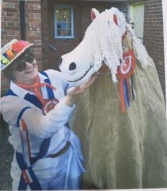
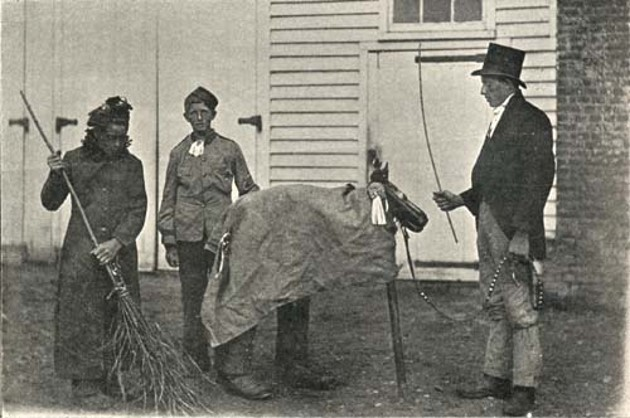
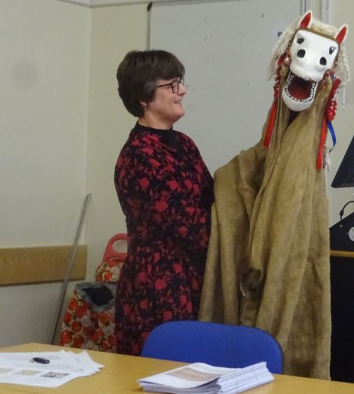

<param ve-config style="article">

## The Hooden Horse: an East Kent tradition.

**Place:** mainly around the Thanet, Dealand Canterbury areas

**Key dates:** 

1839: a Hooden Horse in [Broadstairs](/broadstairs-19th-century) so frightened a lady that she collapsed and died. 

{: .right .dropshadow}

1859: a Hooden Horse in Lower Hardres so frightened a disabled German visitor “that she, who had not put her foot to the ground for seven years, promptly sprang out of her chair, ran indoors, and walked all right for ever afterwards”.[^ref1]

Hop Hoodening Festival, to bless the hop harvest; second Saturday of September each year since 1957.

[Broadstairs](broadstairs-19th-century) Folk Week: first full week of August each year since 1965.

‘… at [Ramsgate](/19c-ramsgate), in Kent I found they begin the festivities of Christmas by a curious procession: a party of young people procure the head of a dead horse, which is affixed by pole about four feet in length; a string is affixed to the lower jaw; a horse-cloth is also attached to the whole, under which one of the party gets, and by frequently pulling on the string, keeps up a loud snapping noise, and is accompanied by the rest of the party, grotesquely habited, with handbells; they thus proceed from house to house, ringing their bells, and singing carols and songs; they are commonly gratified with beer and cake, or perhaps money. This is called, provincially, a Hodening, and … [i]t is I find, general in Thanet on Christmas Eve, and, as far as I can learn, nowhere else …’

May 1807. _European Magazine_: 51 (May 1807) 558.

"… as far back as 1855 the custom of carrying round a horse’s head, made of wood and with moveable jaws, existed in [Margate](/19c-margate). The bearer was accompanied by various musicians, who passed round the hat, …" 

16 November 1907. _Keble’s [Margate](/19c-margate) and [Ramsgate](/19c-ramsgate) Gazette_.

{: .right .dropshadow}

https://www.facebook.com/hoodeners

"… the custom of ‘Hoodening’, or taking round the ‘Hooden Horse’, on Christmas Eve was an annual one in the villages in Thanet half a century ago, and in Birchington, at least, the custom had not died out in 1906 …"

7 December 1907, _Keble’s [Margate](19c-margate) and [Ramsgate](/19c-ramsgate) Gazette._ 

Distinct from other ‘hobby horse’ and animal-characters abundant in English folklore, the Hooden Horse belongs uniquely to Kent and, as Geoff Doel affirms, “the tradition appears to lie solely in the eastern part of the county” (Maylam, et al., 2009, p. 10)
The above quotes from publications of 1807 and 1907 show that Hoodening was well-known in East Kent during the nineteenth century. Today it continues in towns and villages such as St Nicholas-at-Wade, Sarre, Wickhambreaux and Deal. Hop Hoodening in Canterbury Cathedral each September also upholds the tradition, and Hooden Horses feature prominently at the annual [Broadstairs](broadstairs-19th-century) Folk Week and other local folk festivals. Many of Kent’s Morris sides now have a Hooden Horse, with that created in 1959 for East Kent Morris purported to be the first designed in an upright position, enabling him to join in the dancing.

{: .right .dropshadow}

Victorian Hoodeners – usually stable hands or farmworkers needing money to see them through the winter – called at houses in their village around Christmas time. One, stooping and draped in a cloak, carried the skull of a dead horse on a pole. Another led this ‘horse’, while a third tried comically to mount him as he dodged and swayed; once the rider was astride, it was the sport of onlookers to try and knock him off again. In the 1840s, skulls were replaced with wooden heads after a resident of [Broadstairs](broadstairs-19th-century) was literally frightened to death by a Hooden Horse at her door.

The earlier history of the Hooden Horse is a matter of conjecture. It could derive from the fifth century crest of Kent’s first Saxon king, or the Saxon custom of parading animal heads in worship of Odin, whose festival coincides with Christmas. Similar customs took place in East Kent in the seventh century, and links to other ‘Hooding’ and animal-character traditions are plausible.

 
**Article written by:** Jacqui Stamp

### Bibliography

Dixon, G., 1984. _Folktales and Legends of Kent_. Peterborough: Minimax Books.

Field, B. & Field, O., 1983. , _Midsummer Fire; The Story of the Folkestone International Folklore Festival 1961-1981._  Hythe: private publisher.

Frampton, G., 2018. _Discordant Comicals; the Hooden Horse of East Kent, St Nicholas-at-Wade._ Canterbury: Ōzaru Books.

Maylam, P., 1909. _The Hooden Horse, an East Kent Christmas Custom._  Canterbury: Cross and Jackman.

Maylam, R., Lynn, M. & Doel, G., 2009. _Percy Maylam’s The Kent Hooden Horse_. Stroud: The History Press.

https://vimeo.com/408562819/78b21d952c

### Notes

[^ref1]: Maylam 53-54.
