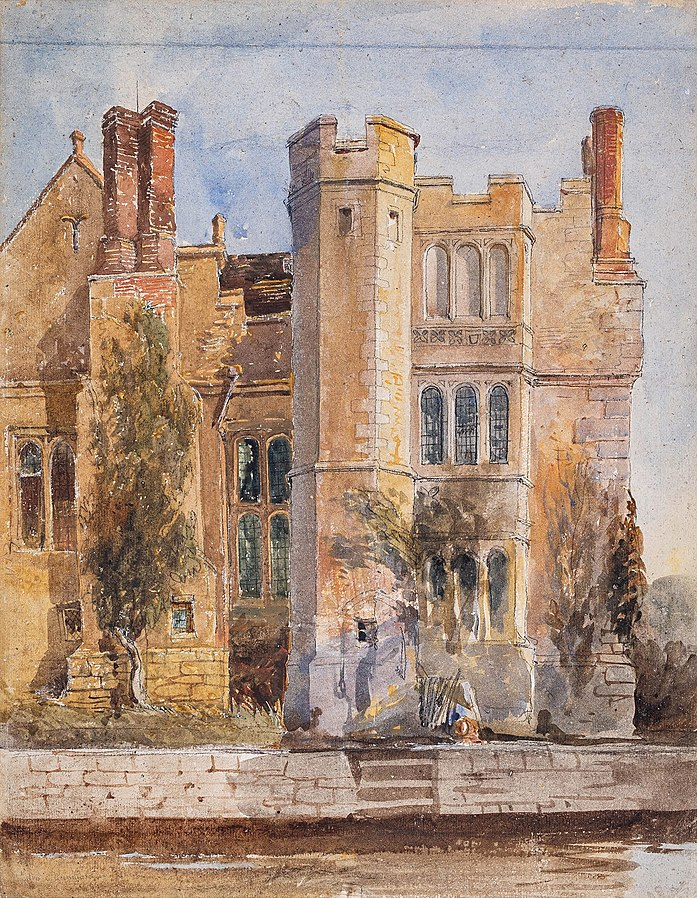

## Henry James 

**Hever Castle** 1895-1907

{: .right .dropshadow}

By which famous Henry was Hever Castle put on the map?

In 1876, when armchair tourists could very enjoyably ensconce themselves in Old English Homes: A Summer’s Sketch-Book, by the photographer and essayist Stephen Thompson, there was only one possible answer to that question: “Hever Castle, as every one knows, … was the birthplace of Anne Boleyn, wife of Henry VIII., the abode in which she passed her girlhood, and her residence during the years of courtship preceding that fatal marriage.” The vignette into which Thompson’s chapter on Hever dissolves could not be more positive about putting the king at the scene: “Henry strides into the court-yard, Anne is in her lover’s arms; while the Royal Standard shakes out its heavy folds above the little tower of Hever.”

Thompson would not live to see a second Henry, who when Old English Homes came out was not yet settled in Britain, lay the basis for an alternative answer. Henry James (1843–1916), not a monarch but to his fellow writers a genuinely Masterly defender of the faith, strode into the courtyard at Hever on an autumn day in 1890, accompanied by Isabella Stewart Gardner. He stored the memory of that visit until he was ready to turn it to literary account by offering a view of the old English home, noted and moated, which was very different from Stephen Thompson’s.

The opportunity came in the form of a storyline idea which first occurred to James at the end of 1892 as a challenge to the stereotyping of American incomers as unable to understand English heritage except in terms of plunder and profit. He would make an American rather than an English character into a paradoxical embodiment of the values “of attachment to the past, of romance, of history, continuity and conservatism” . He decided, as he refined his idea, that he would do so by centring the plot upon a prize piece of historic real estate saved for the nation by a beneficent and munificent intervention from across the Atlantic which “repairs … redeems … rescues and restores” (Notebooks, 6 February 1895). He would emphasise the redemptive nature of the intervention by calling the deliverer Mrs Gracedew.

That plot served James on three separate occasions: in 1895, when he used it in a short play entitled Summersoft; in 1898, when he transferred it to a prose tale entitled [Covering End](https://en.wikisource.org/w/index.php?title=Special:ElectronPdf&page=Covering+End&action=show-download-screen) (which he coupled with The Turn of the Screw); and finally in a three-act comedy, [The High Bid](https://www.theguardian.com/stage/2020/aug/10/forgotten-plays-no-11-the-high-bid-1908-by-henry-james), that was written in 1907 and then played in Edinburgh in 1908 and London in 1909. The 1898 change to the title of the work resulted from the new name of the house—no longer Summersoft, as in 1895, but Covering End. Although in 1907 James refrains from renaming the house again, there are small but significant differences in what he visualises.

In writing these works James is generally thought to have had Osterley Park, and possibly Hatfield House, in mind. However, some details—-the age of the house; the presence in it of a Flemish tapestry, a tattered banner from the Battle of Blenheim, and a suit of armour worn at Tewkesbury; the grand staircase made of “fine old stone or oak”—better fit Hever Castle. It is particularly on its final appearance, in 1907, that the old English country house conjured up by James seems coloured by his memories and impressions of Hever; and there is a very good reason for this. In the summer of 1903 Hever Castle had been acquired by William Waldorf Astor. Astor had by then been a naturalised British citizen for four years. To most observers, however, this acquisition constituted a striking real-life example of an American intervening to rescue and repair a decaying piece of English heritage. Astor relandscaped the gardens, creating a maze made of yew hedges, and embarked on an extensive rebuilding programme. Inside the house he installed such mod cons as electricity and central heating, but he also hung tapestries and restored many original features. This made Hever both more Tudor and more Edwardian. According to Ditchfield and Clinch in their 1907 guidebook [Memorials of Old Kent](https://openlibrary.org/books/OL7122534M/Memorials_of_old_Kent), what Astor now owned was “a curious mixture of a domestic house and a feudal castle.”

James could hardly help seeing a good deal of Mrs Gracedew in William Waldorf Astor. Astor was also a figure in whom James saw a lot of himself, and with whom Van Wyck Brooks had explicitly compared him. In the same year, 1899, that brought Astor British citizenship, James had purchased (having previously rented) a historic property near the Kent-Sussex border: Lamb House in Rye. It is no wonder, as in an extensive rebuilding programme of his own James set about turning the short story that was previously a play back into drama again, that the fictional Covering End and the Boleyns’ Hever Castle came increasingly to coalesce.

**Article written by:**

### Bibliography 
Ditchfield, P. H. and George Clinch. _Memorials of Old Kent._ London: Bemrose, 1907.   
Thompson, Stephen. _Old English Homes: A Summer’s Sketch-Book._ London: Sampson Low, Marston, Low and Searle, 1876.
