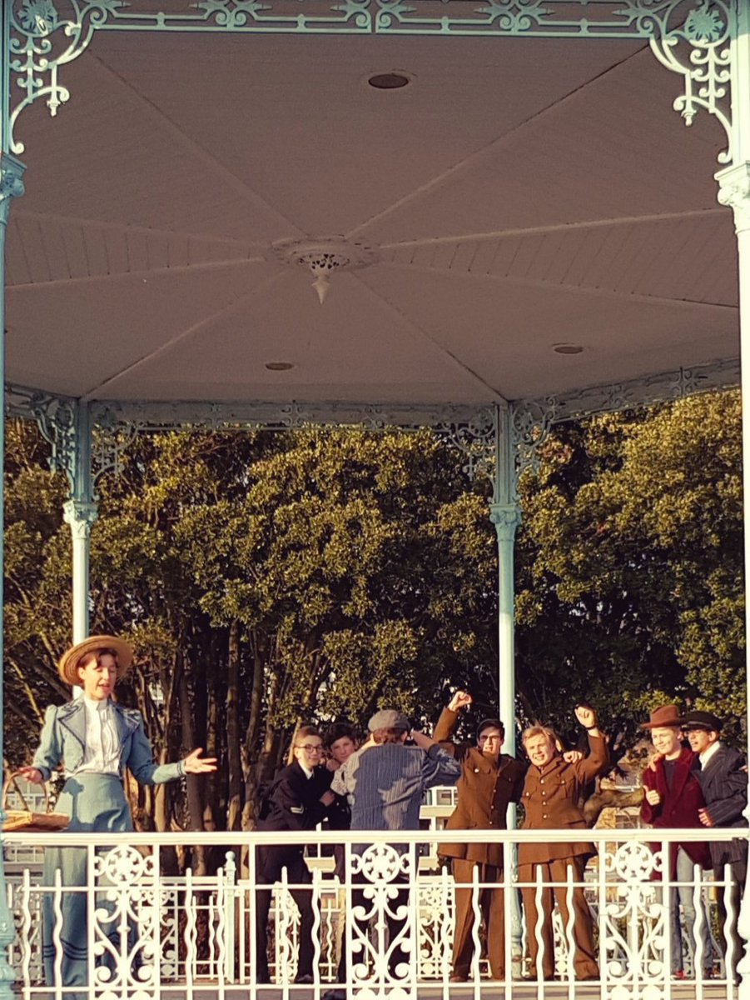

# Folkestone and World War 1

The outbreak of war in August 1914 led to a transformation of this genteel resort. Folkestone, with its port and excellent rail and road links, became the main point of embarkation and return for the battlefields of France and Flanders. From August 1914 until the summer of 1919, nearly 10 million soldiers were safely transported across the English Channel. In addition, Folkestone witnessed the departure of over 1 million civilians to France, including large numbers of Red Cross nurses and other war workers. In the reverse direction, Folkestone received thousands of Belgian refugees who were provided with food and shelter before the majority were later dispersed around the country.

The town’s garrison at Shorncliffe was immediately sent to France as part of the original British Expeditionary Force (BEF). In their place, Shorncliffe received a multi – ethnic host of soldiers from all over the British Empire, together with British volunteers who had answered Lord Kitchener’s call.  Many of these troops had to be billeted in the town itself, and this influx, combined with the arrival of Chinese labourers and Belgian, French, Russian and Serbian troops, turned Folkestone into a cosmopolitan community. Of all the troops assembling in Folkestone, it was the Canadians who made the greatest impression upon the social life of the town – and many of its women. As volunteers paid almost 3 times as much as a British soldier, they became popular patrons and welcome houseguests.

The people of Folkestone were not immune to the horrors of war in a more direct sense. The town was bombed by German Zeppelins and aircraft on several occasions, the most notable of which, known as the Tontine Street bombing, took place on the 25th May 1917. Over 70 lives were lost and over a hundred injured during this raid. These figures, each involving a personal tragedy, seem insignificant when compared to the bombing of the Second World War, but this was Folkestone’s introduction to total war.

{: .right .dropshadow}

[First of the Feathers: Soldiers and Suffragettes]( https://www.youtube.com/watch?v=461nK7mazNo) Script by Leah Hockley. Performed by Georgie Oulton and boys from the Harvey Grammar School, Folkestone.’

The sight of able bodied young men, of military age, perambulating along the Leas in August 1914, rather then volunteering to fight in the Army, so enraged a retired Admiral that he decided to do something about it. Admiral Charles Fitzgerald , a Folkestone resident, deputed 30 local women to approach these ‘slackers’ to remind them of their patriotic duty and to present them with an emblem of cowardice – a white feather. Fitzgerald evidently reckoned a man would be more fearful of public humiliation by a woman, than by facing the German army. The white feather scheme spread across the United Kingdom, at a time when all enlistment was on a voluntary basis. The government gave the scheme its tacit report, but enthusiasm faded when the scale of casualties on the western front became apparent and conscription was introduced in 1916.

**Article written by:**

### Bibliography and further reading

Wynn, Stephen. _Folkestone in the Great War_. Barnsley: Pen and Sword 2017.

See also: Folkestone Library

www.stepshort.co.uk

www. Kentww1.com

blogs.kent.ac.uk/gateways/folkestone

