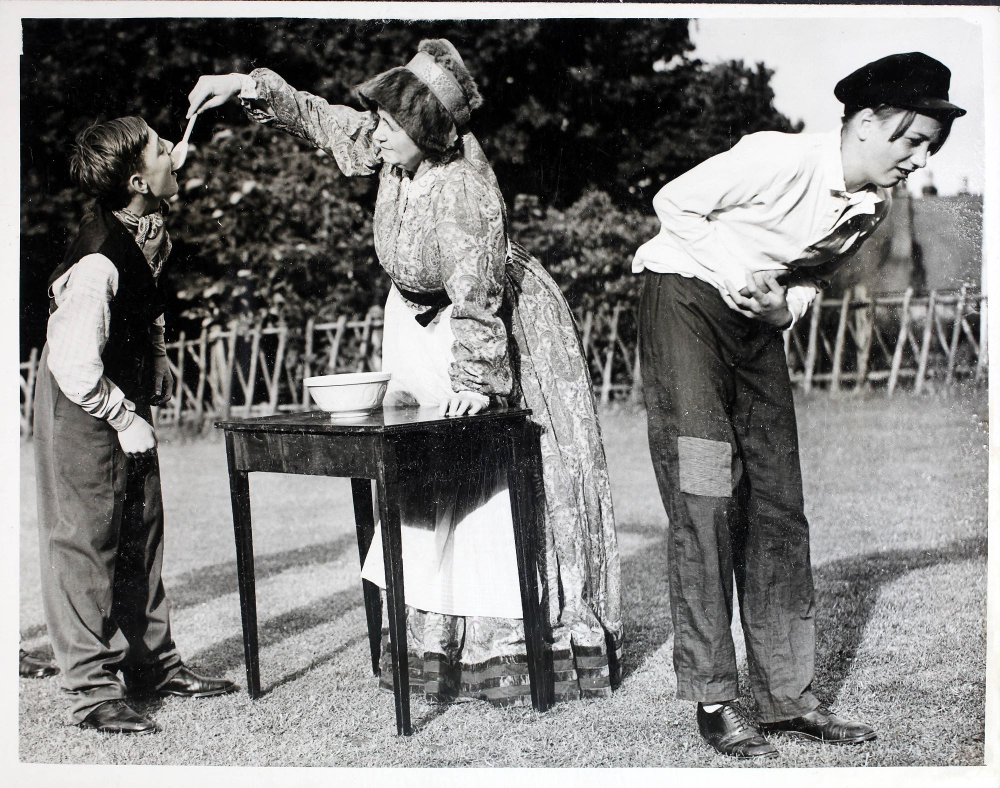

<param ve-config style="article">

## Gladys Waterer (1885 - 1971)

**Lived in:** 2 Nuckell’s Place (Dickens Museum) until death in 1971 

**Place:** Broadstairs

‘”Who wants to know what everything means? Novels are not meant to be real life, only stories to amuse us. It is wrong to take such things seriously.” 

“But you do take them seriously,” objected Ethel. “You read volumes and volumes of such stuff, and it’s bad for you. It fills you with all sorts of fancies and notions, that are worse than useless in this practical world.”’  _The Third Chance_, 1912. 

Gladys Waterer, a minor novelist and playwright, was a founding member of the Dickens Fellowship in Broadstairs in 1937. She was involved with the annual festival for the rest of her life and dramatized every one of the novels bar _Oliver Twist_. 

{: .right .dropshadow}

Gladys Waterer was best known in her lifetime as a dramatist and leading light of the [Broadstairs] branch of the Dickens Fellowship from its inauguration in 1837. Little else is known about her , except that by the 1930s she was living with Dora Tatum at [2 Nuckell’s Place](/dickens/david-copperfield-nuckells-place), the original of Aunt Betsey’s cottage in _David Copperfield_. For the initial festival she adapted _Pickwick_ with Nina Boreham, followed by _David Copperfield_ (complete with donkeys) in 1938. By 1964 she had tackled every one of the major works bar _Oliver Twist_, which she candidly admitted she couldn’t face living with for the eight months it would have taken to prepare a suitable play. 

But while her name appears only sporadically in newspapers and most often in connection with [Dickens](/dickens/dickens-biography), Waterer was herself the author of at least two novels, _The Third Chance_ (1912) and _The Lady in Mauve_ (1931). The earlier novel reflects her own interest in the politics of local amateur dramatic productions. Much of the tension devolves from the heroine Ethel’s triumphantly redemptive love for an alcoholic actor who once saved her from a teenage seduction and who is drafted in to make up the numbers in a provincial performance. Less than subtly disguised as Seagate, Eastgate and Haregate, the neighbouring towns of Margate, Ramsgate and Broadstairs provide an idyllic coastal setting, inflected with a keen and often witty observation of local culture. 

**Article written by:**

### Bibliography

Unattributed. ‘Gladys Waterer Talks Dickens at Broadstairs’. _Illustrated London News_. 11  March 1964. 90. 

Waterer, Gladys. _The Third Chance._ London: George Allen & Co., 1912. 

 

 

 

 
