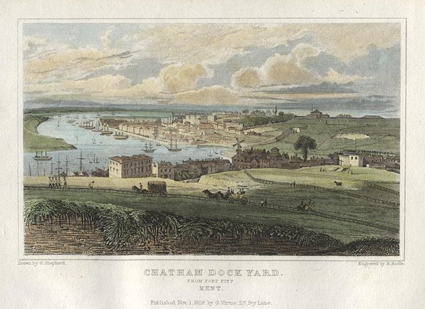

<param ve-config style="article">

## Chatham 

**Event:** 1816-1822 John Dickens based at [Chatham Dockyard](/19c-chatham-dockyard), working for the Naval Pay Office.

>‘snug under hill-sides of corn-fields, hop gardens, and orchards; its great chimneys smoking with a quiet—almost a lazy—air, like giants smoking tobacco; and the great Shears moored off it, looking meekly and inoffensively out of proportion, like the Giraffe of the machinery of creation. The store of cannon on the neighbouring gun-wharf, had an innocent 
toy-like appearance, and the one red-coated sentry on duty over them was a mere toy figure, with a clockwork movement. As the hot sunlight sparkled on him he might have passed for the identical little man who had the little gun, and whose bullets they were made of lead, lead, lead.’ ‘The Uncommercial Traveller’. _All the Year Round_. 29 August 1863.

{: .right .dropshadow}

Charles Dickens’s Kent childhood, celebrated in both his journalism and his major fiction, was a direct result of his father’s move from Portsmouth to the [Chatham Dockyard](/19c-chatham-dockyard) in 1816. Visiting today it is impossible to recreate the sense of constant bustle and noise that would have pervaded the scene in Dickens’s time. But the layout of the buildings allows some sense of the docks as a micro-community, an exciting and at the same time familiar space for a child to explore in the aftermath of the Napoleonic Wars.

Initially the family lived at 2 Ordnance Terrace, on the hills above the estuary. During these years John Dickens would sometimes take Charles and his sister Fanny aboard the Chatham, a small naval yacht in which he sailed to Sheerness and back. Claire Tomalin writes that ‘After hours of sailing, as they approached Sheerness and the Thames '''estuary''', the far Essex bank came into view five miles away across a world of water. This landscape and the sludge-coloured tidal rivers haunted him all his life and became part of the fabric of his later novels.’[^ref1] 

In 1821 continued money difficulties forced a move to 18 St Mary’s Place, closer to the dockyard, and in the same year John Dickens covered a major fire in Chatham for The Times. His concern for the residents most deeply affected by this catastrophe is easily lost in the feeling of déjà vu for anyone who remembers Mr Micawber in _David Copperfield_. The rhetorical flourish and the preoccupation with financial ruin are both familiar from the novel, in lines such as ‘several houses, and those, we understand, principally belonging to persons whose ruin must be the consequence, were wholly unensured [sic]’.[^ref2] In danger of financial ruin himself, by 1822 John Dickens had left his post at the Naval Pay Office and moved the family to London.

### Bibliography 

Dickens, Charles. ‘The Uncommercial Traveller.’ http://www.djo.org.uk/all-the-year-round/volume-x/page-12.html Accessed 14 November 2018.

Dickens, John. ‘Further Particulars.’ _The Times_. 4 Mar. 1820. ''The Times Digital Archive.'' Accessed 4 November 2018. Gale Document Number: CS34227812.

### References

[^ref1]: Tomalin 13.
[^ref2]: ‘Further Particulars’.

### Links
https://lukemckernan.com/2020/06/08/day-dreams-and-bad-dreams/
[Ancestry Images](https://www.ancestryimages.com/proddetail.php?prod=h4335)
